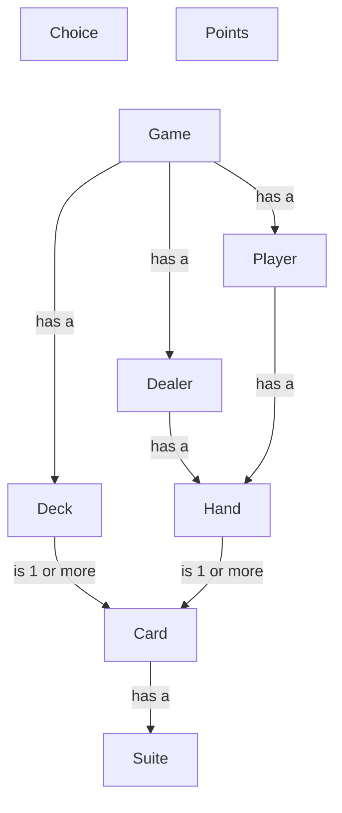
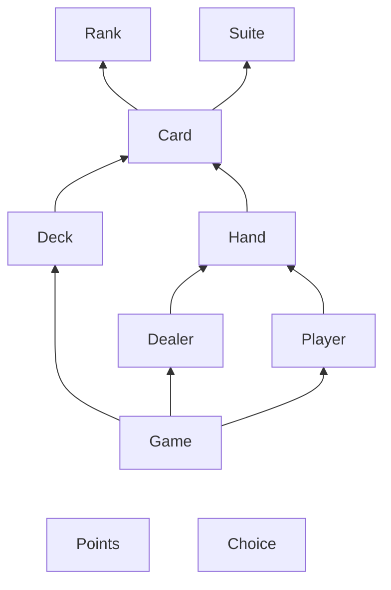

### Domain models

```mermaid
flowchart TB
Choice ~~~ Game
Points ~~~ Game
Card -- has a --> Suite
Deck -- is 1 or more --> Card
Hand -- is 1 or more --> Card
Dealer -- has a --> Hand
Player -- has a ---> Hand
Game -- has a --> Dealer
Game -- has a --> Player
Game -- has a --> Deck
```

### Implementation

```mermaid
flowchart BT
Card --> Rank
Card --> Suite
Deck --> Card
Hand --> Card
Dealer --> Hand
Player --> Hand
Game --> Deck
Game --> Player
Game --> Dealer
Points ~~~ Game
Choice ~~~ Game

```
